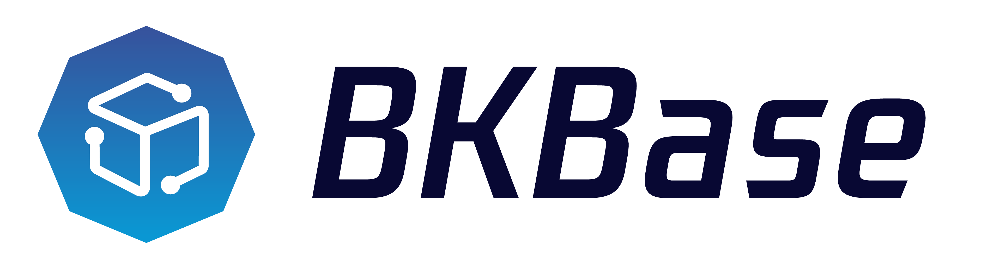

---

English | [简体中文](README.md)

> **Note**: The `master` branch may be in an *unstable or even broken state* during development.
Please use [releases](https://github.com/tencent/bk-base/releases) instead of the `master` branch in order to get stable binaries.

BK-BASE is a basic platform focusing on the field of operation and maintenance, creating a one-stop, low-threshold basic service. By simplifying the collection and acquisition of operation and maintenance data, improving the efficiency of data development, assisting operation and maintenance personnel in real-time operation and maintenance decision-making, and assisting the digital and intelligent transformation of enterprise operation systems.

## Overview
* [Design Philosophy](docs/overview/design_en.md)
* [Architecture Design](docs/overview/architecture_en.md)
* [Code Directory](docs/overview/code_framework_en.md)

## Features
* One-stop, Low-barrier Development
* Integrating Multiple Types of Data Sources
* Unified Diversified Data Query
* Full Link Data Tracing Management

## Getting Started
* [Download and Compile (In Chinese)](docs/install/source_compile.md)
* [Installation and Deployment (In Chinese)](docs/install/installation.md)

## Support
- [User Guide(in Prepare)](https://bk.tencent.com/docs)
- [BK forum](https://bk.tencent.com/s-mart/community)

## BlueKing Community

- [BK-CI](https://github.com/Tencent/bk-ci)：BlueKing Continuous Integration is a continuous integration and continuous delivery system that can easily present your R & D process to you.
- [BK-BCS](https://github.com/Tencent/bk-bcs): BlueKing Container Service is an orchestration platform for microservices based on container technology.
- [BK-CMDB](https://github.com/Tencent/bk-cmdb): BlueKing Configuration Management DataBase (BlueKing CMDB) is an enterprise level configuration management platform for assets and applications.
- [BK-PaaS](https://github.com/Tencent/bk-PaaS): BlueKing PaaS is an open development platform that allows developers to create, develop, deploy and manage SaaS applications quickly and easily.
- [BK-SOPS](https://github.com/Tencent/bk-sops): BlueKing Standard OPS (SOPS) is a light-weighted SaaS product in the Tencent BlueKing product system designed for the orchestration and execution of tasks through a graphical interface.

## Contributing

- Please read [Contributing](docs/overview/CONTRIBUTING_EN.md) for the branch management, issue and pr specifications of BK-BASE.
- [Tencent Open Source Incentive Program](https://opensource.tencent.com/en/contribution) encourages the participation and contribution of developers. We look forward to having you join it.

## License
BK-BASE is based on the MIT license. Please refer to [LICENCE](LICENSE.txt) for details.
