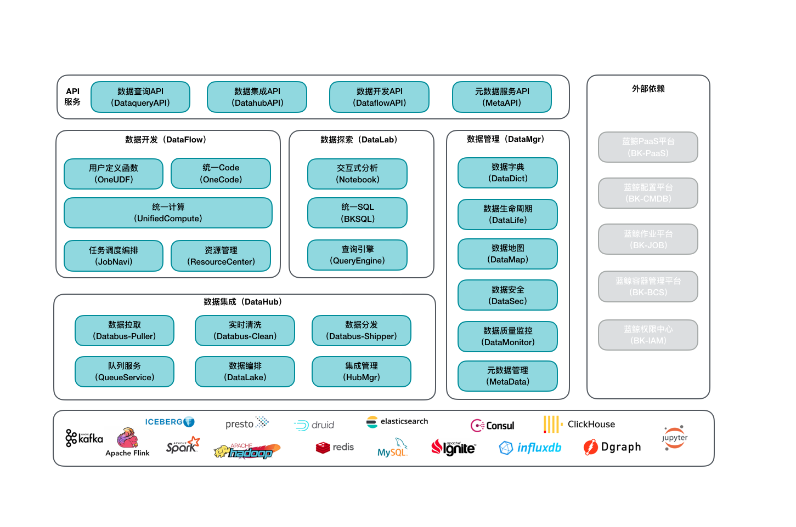

# 蓝鲸基础计算平台(BK-BASE)架构

平台架构总体分为三层：

- 开源组件层：可支持多种开源和腾讯自研的大数据组件

> 1. 计算引擎：Flink 和 Spark 等。
> 2. 存储系统：关系型 MySQL 、用于日志检索 ElasticSearch、KV 型存储 Redis、分布式缓存 Ignite以及分布式文件系统 HDFS 等。

- 中间服务层：

> 1. 数据集成服务（Datahub），主要由 Kafka 消息队列为核心的数据总线组成，包含数据拉取、实时清洗、数据分发、队列服务、数据编排、集成管理功能，它像一根总线连接着数据处理和存储查询。
> 2. 数据开发服务（DataFlow），隐藏各种计算框架的复杂性形成统一计算服务，基于 SQL 和图形拖拽将实时流处理和离线批处理结合，可以使用统一计算对数据进行实时、离线、聚合、关联等复杂数据处理。
> 3. 数据探索服务（DataLab），查询引擎支持多种存储系统，包括关系型数据库 MySQL、离线存储 HDFS、全文检索 Elasticsearch、时序型数据库 TSDB 和 KV 存储 Redis 等，现阶段最新版本支持 ANSI SQL 和文本检索两类查询方式。
> 4. 数据管理（DataMgr），提供元数据管理、数据质量监控、数据安全、数据地图、数据生命周期、数据字典等服务。

- API 服务层：提供中间服务层对应的 API 服务，包含数据查询、数据集成、数据开发、元数据服务等，为上层应用提供接口调用服务。

此外，右侧为平台依赖的蓝鲸产品，包含 [蓝鲸PaaS服务（BK-PaaS）](https://github.com/Tencent/bk-PaaS)、[蓝鲸配置平台（BK-CMDB）](https://github.com/Tencent/bk-cmdb)、蓝鲸作业平台（BK-JOB）、[蓝鲸容器管理平台（BK-BCS）](https://github.com/Tencent/bk-bcs)、蓝鲸权限中心（BK-IAM）, 在 [蓝鲸官网](https://bk.tencent.com/download/) 可以找到对应产品的介绍。

