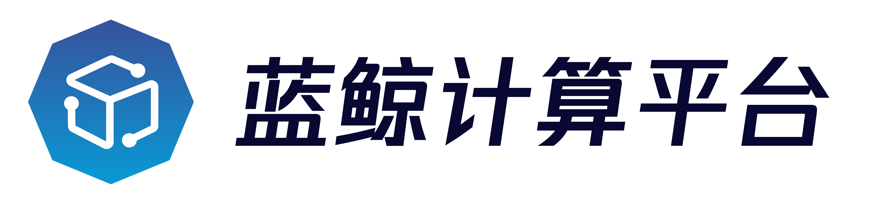

<!---
 Tencent is pleased to support the open source community by making BK-BASE 蓝鲸基础平台 available.
 Copyright (C) 2021 THL A29 Limited, a Tencent company.  All rights reserved.
 BK-BASE 蓝鲸基础平台 is licensed under the MIT License.
 License for BK-BASE 蓝鲸基础平台:
 --------------------------------------------------------------------
 Permission is hereby granted, free of charge, to any person obtaining a copy of this software and associated
 documentation files (the "Software"), to deal in the Software without restriction, including without limitation
 the rights to use, copy, modify, merge, publish, distribute, sublicense, and/or sell copies of the Software,
 and to permit persons to whom the Software is furnished to do so, subject to the following conditions:
 The above copyright notice and this permission notice shall be included in all copies or substantial
 portions of the Software.
 THE SOFTWARE IS PROVIDED "AS IS", WITHOUT WARRANTY OF ANY KIND, EXPRESS OR IMPLIED, INCLUDING BUT NOT
 LIMITED TO THE WARRANTIES OF MERCHANTABILITY, FITNESS FOR A PARTICULAR PURPOSE AND NONINFRINGEMENT. IN
 NO EVENT SHALL THE AUTHORS OR COPYRIGHT HOLDERS BE LIABLE FOR ANY CLAIM, DAMAGES OR OTHER LIABILITY,
 WHETHER IN AN ACTION OF CONTRACT, TORT OR OTHERWISE, ARISING FROM, OUT OF OR IN CONNECTION WITH THE
 SOFTWARE OR THE USE OR OTHER DEALINGS IN THE SOFTWARE.
-->



---
[](LICENSE.txt)
[]()
[]()

数据管理元数据服务api（MetaApi），元数据服务对外提供能力的统一入口。

## Overview
* [架构设计](docs/overview/architecture.md)
* [代码目录](docs/overview/code_framework.md)

## Features
* 对平台和其他api提供元数据查询、元数据同步、元数据修改等能力的统一入口

## Getting started
* [本地开发测试](docs/overview/develop.md)
* [正式环境部署](docs/overview/deploy.md)

## Roadmap
* [版本日志](docs/release.md)

## License
项目基于 MIT 协议， 详细请参考 [LICENSE](LICENSE.txt) 。

## Others
### 国际化i18n方案

1. 进入子模块目录，需要进入PIZZA虚拟环境，保证所有的python依赖正确
```
mkdir locale  # 如果子模块已经有locale目录，不需要再创建
django-admin.py makemessages -l en
django-admin.py makemessages -l zh_Hans
```

2. 修改生成的翻译文件

3. 在子模块中执行，需要进入PIZZA虚拟环境，保证所有的python依赖正确
```
django-admin.py compilemessages
```

4. 提交变更
