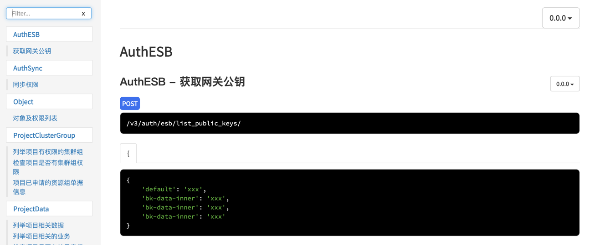

<!---
 Tencent is pleased to support the open source community by making BK-BASE 蓝鲸基础平台 available.
 Copyright (C) 2021 THL A29 Limited, a Tencent company.  All rights reserved.
 BK-BASE 蓝鲸基础平台 is licensed under the MIT License.
 License for BK-BASE 蓝鲸基础平台:
 --------------------------------------------------------------------
 Permission is hereby granted, free of charge, to any person obtaining a copy of this software and associated
 documentation files (the "Software"), to deal in the Software without restriction, including without limitation
 the rights to use, copy, modify, merge, publish, distribute, sublicense, and/or sell copies of the Software,
 and to permit persons to whom the Software is furnished to do so, subject to the following conditions:
 The above copyright notice and this permission notice shall be included in all copies or substantial
 portions of the Software.
 THE SOFTWARE IS PROVIDED "AS IS", WITHOUT WARRANTY OF ANY KIND, EXPRESS OR IMPLIED, INCLUDING BUT NOT
 LIMITED TO THE WARRANTIES OF MERCHANTABILITY, FITNESS FOR A PARTICULAR PURPOSE AND NONINFRINGEMENT. IN
 NO EVENT SHALL THE AUTHORS OR COPYRIGHT HOLDERS BE LIABLE FOR ANY CLAIM, DAMAGES OR OTHER LIABILITY,
 WHETHER IN AN ACTION OF CONTRACT, TORT OR OTHERWISE, ARISING FROM, OUT OF OR IN CONNECTION WITH THE
 SOFTWARE OR THE USE OR OTHER DEALINGS IN THE SOFTWARE.
-->

目前平台 API 统一以 apidoc 注释的方式来描述 API 的功能和用法，主要对以下几方面进行描述

- URL
- 方法：get | post | patch | put | delete
- 名称描述
- 参数说明 + 参数样例
- 响应结果样例 + 响应结果说明


## 1. apidoc 格式示例

apidoc 具体安装方式和书写语法请查看官网文档 http://apidocjs.com/，这里以 authapi 为例说明需要重要关注的内容。

```python
def batch_check(self, request):
    """
    @api {post} /v3/auth/users/batch_check/  批量校验用户与对象权限
    @apiName batch_check_perm
    @apiDescription  批量校验用户与对象权限，可以支持不同对象、不同动作，同时校验
    @apiGroup UserPerm
    @apiParam {Dict[]} permissions 待鉴权列表
    @apiParam {String} permissions.user_id 待鉴权用户
    @apiParam {String} permissions.action_id 待鉴权功能
    @apiParam {String} permissions.object_id 待鉴权对象，如果不存在绑定对象，则传入 None
    @apiParamExample {json} 校验用户对结果表是否有查询数据权限
        {
            permissions: [
                {
                    "user_id": "admin",
                    "action_id": "result_table.query_data",
                    "object_id": "100107_cpu_parse",
                }
            ]
        }
    @apiSuccess {Boolean} data.result 鉴权结果
    @apiSuccessExample {json} Succees-Response
        {
            "result": true,
            "data": [
                {
                    "user_id": "admin",
                    "action_id": "result_table.query_data",
                    "object_id": "100107_cpu_parse",
                    "result": true
                }
            ],
            "message": "ok",
            "code": "1500200",
            "errors": None
        }
    """
    pass
```

一个 DataAPI 说明文档必须包含 `@api`、`@apiName`、`@apiGroup` ，选择性地包含有 `@apiDescription`、`@apiParam`、`@apiParamExample`、`@apiSuccessExample`、`@apiSuccess` 等元素

- `@api` ：url 以 /v3/ 开头，以 / 结尾，末尾对 api 称呼，请使用中文名称，简短说明，不可缺少
- `@apiName` ：api 名称，一般使用全英文，在生成文档页面是会与 apiGroup 合并，作为页面的唯一锚点
- `@apiGroup`:  对 api 进行分组命名
- `@apiDescription` : 选择性补充
- `@apiSuccessExample` :  请求成功的响应样例，可以有多个样例。不同样例，需要命名不同的名称，比如 `Succees-Response1` 、`Succees-Response2` 、...

## 2. 文档生成方式

使用 npm 安装 apidoc 工具 

```
npm install -g apidoc
```

进入应用目录，执行编译，生成文档
```
cd auth
apidoc -i . -o doc/
```

使用浏览器打开 doc/index.html 页面即可查看文档
