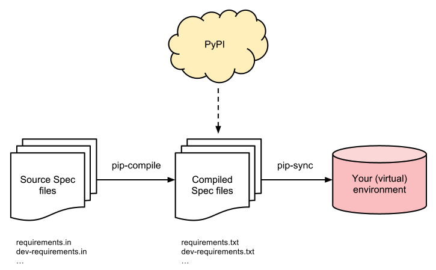
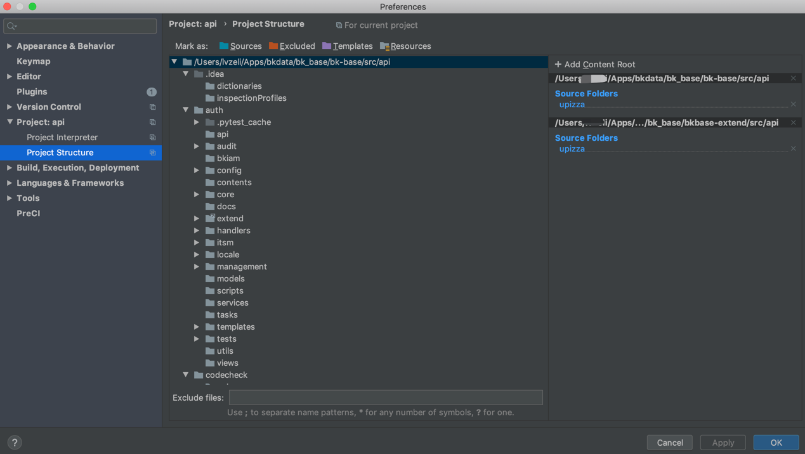
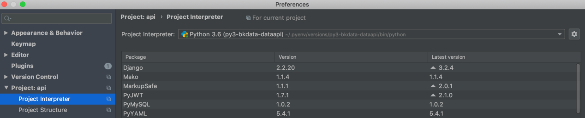
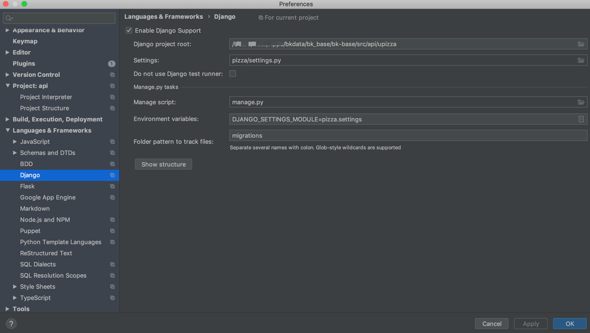
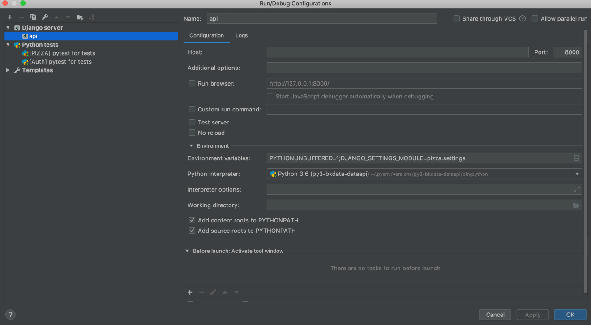
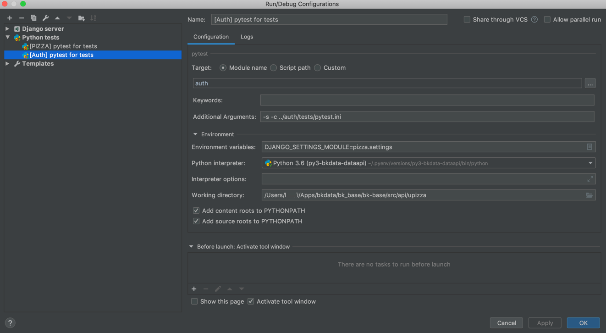

<!---
 Tencent is pleased to support the open source community by making BK-BASE 蓝鲸基础平台 available.
 Copyright (C) 2021 THL A29 Limited, a Tencent company.  All rights reserved.
 BK-BASE 蓝鲸基础平台 is licensed under the MIT License.
 License for BK-BASE 蓝鲸基础平台:
 --------------------------------------------------------------------
 Permission is hereby granted, free of charge, to any person obtaining a copy of this software and associated
 documentation files (the "Software"), to deal in the Software without restriction, including without limitation
 the rights to use, copy, modify, merge, publish, distribute, sublicense, and/or sell copies of the Software,
 and to permit persons to whom the Software is furnished to do so, subject to the following conditions:
 The above copyright notice and this permission notice shall be included in all copies or substantial
 portions of the Software.
 THE SOFTWARE IS PROVIDED "AS IS", WITHOUT WARRANTY OF ANY KIND, EXPRESS OR IMPLIED, INCLUDING BUT NOT
 LIMITED TO THE WARRANTIES OF MERCHANTABILITY, FITNESS FOR A PARTICULAR PURPOSE AND NONINFRINGEMENT. IN
 NO EVENT SHALL THE AUTHORS OR COPYRIGHT HOLDERS BE LIABLE FOR ANY CLAIM, DAMAGES OR OTHER LIABILITY,
 WHETHER IN AN ACTION OF CONTRACT, TORT OR OTHERWISE, ARISING FROM, OUT OF OR IN CONNECTION WITH THE
 SOFTWARE OR THE USE OR OTHER DEALINGS IN THE SOFTWARE.
-->
[TOC]

如何在本地进行 API 开发，接下来以 auth 模块进行演示

## 1. 初始化环境

当前依赖 python 3.6+ 版本

### 1.1 包管理方式

pizza 开发框架使用 [pip-tools](https://pypi.org/project/pip-tools/) 工具来管理 pizza 与应用之间的包版本关系



pizza 通过 requirements.in 文件申明自身的包版本依赖，然后通过 pip-compile 指令生成 requirements.txt。注意 requirements.txt 需要提交，
具体环境的安装和部署环节还是以 requirements.txt 为主。 

```
pip install pip-tools
pip-compile --no-emit-index-url --no-emit-trusted-host requirements.in
```


应用可以在自身模块下添加 requirements.in 文件补充依赖包，比如添加 `auth/requirements.in` 文件，然后通过 pip-compile 指令生成 
`auth/requirements.txt` 文件

```
# `auth/requirements.txt` 文件内容

-c ../upizza/requirements.txt
mako==1.1.4
six==1.15.0
PyYAML==5.4.1
cached-property==1.5.1
redis==2.10.5
redis-py-cluster==1.3.4
django-filter==2.4.0

# 自研包
bk-iam==1.0.9
```

应用目录下的 `auth/requirements.in` 文件需要添加 `-c ../upizza/requirements.txt` 指令引入 pizza 包依赖文件，进行联合检查，统一依赖包
版本号，避免依赖包版本冲突

### 1.2 包安装

执行 pip 安装指令，安装 pizza 和应用的 requirements.txt 文件
```
pip install -r upizza/requirements.txt
pip install -r auth/requirements.txt 
```

## 2.1 本地 Pycharm 配置

### 2.2 建立项目结构关系


将 `bkbase/src/api` 目录和 `bkbase-extend/src/api` 仓库都作为 content-root 加入到项目中，然后将 `bkbase/src/api/upizza` 和 
`bkbase-extend/src/api` 设置为 source 源目录

目前未能解决 auth/extend 引用问题，原因是当工程在 bkbase 下找到 auth 目录，接下来则会在 auth 目录下寻找 extend 目录，故寻而不得。暂时使用
软链方式解决

```
ln -s ${BKBASE_EXTEND}/src/api/auth/extend ${BKBASE}/src/api/auth/extend 
```


### 2.3 添加环境变量文件
在 upizza 目录下添加环境变量文件 env 文件，请查询对应占位符的意义，然后替换为合适的值

```
RUN_VERSION=__RUN_VERSION__
RUN_MODE=LOCAL

AUTH_API_HOST=__AUTH_API_HOST__
AUTH_API_PORT=__AUTH_API_PORT__
META_API_HOST=__META_API_HOST__
META_API_PORT=__META_API_PORT__
SMCS_API_URL=__SMCS_API_URL__

PAAS_HOST=__PAAS_HOST__
PAAS_HTTP_PORT=__PAAS_HTTP_PORT__

APP_ID=__APP_CODE__
APP_TOKEN__APP_TOKEN__

# 加解密配置
CRYPT_ROOT_KEY=__BKDATA_ROOT_KEY__
CRYPT_ROOT_IV=__BKDATA_ROOT_IV__
CRYPT_INSTANCE_KEY=__CRYPT_INSTANCE_KEY__

# 基础数据库配置
CONFIG_DB_HOST=__MYSQL_DATAHUB_IP0__
CONFIG_DB_PORT=__MYSQL_DATAHUB_PORT__
CONFIG_DB_USER=__MYSQL_DATAHUB_USER__
CONFIG_DB_PASSWORD=__MYSQL_DATAHUB_PASS__

# 应用模块
APP_NAME=auth
```

### 2.4 选择 PYTHON 环境


### 2.5 配置指令

#### 2.5.1 runserver

配置 Django 基础信息 


选择 django-server 指令


#### 2.5.2 run-pytest

选择 pytest 指令，注意当通过 -c 指定 `pytest.ini` 文件时，需要通过 .. 往上跳一级获取文件

