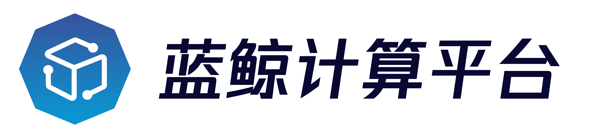

---
[](LICENSE.txt)
[](docs/release.md)
[]()

数据管理元数据服务SDK（MetaData-SDK）提供元数据变更hook抓取、元数据事件订阅等功能

## Overview
* [架构设计](docs/overview/architecture.md)
* [代码目录](docs/overview/code_framework.md)

## Features
* 通用的元数据抓取SyncHook框架，目前支持sqlalchemy作为引擎，其他引擎持续添加中
* 元数据事件订阅客户端，可订阅元数据服务产生的事件消息

## Getting started
* [本地开发测试](docs/overview/develop.md)
* [正式环境部署](docs/overview/deploy.md)

## Roadmap
* [版本日志](docs/release.md)

## License
项目基于 MIT 协议， 详细请参考 [LICENSE](LICENSE.txt) 。

## Others
### SDK文档生成(sphinx-apidoc)
1. 确保环境下安装sphinx-apidoc组件
```
pip install sphinx
```

2. 清理make缓存
```
make clean
```

3. 生成文档
```
sphinx-apidoc -o docs/ metadata_client -f
cd docs
cp modules.rst.bak modules.rst
shopt -s extglob
rm !(metadata_client.rst|modules.rst|modules.rst.bak)
cd ..
make html
```

####Or quickly run `sh make_doc.sh` under meta-sdk dir
```
sh make_doc.sh
```
